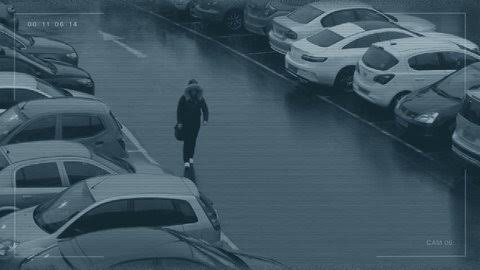

# 🛡️ Vision-Guard

A real-time object detection system optimized for CCTV footage analysis. This project utilizes the YOLOv8 architecture to identify and track people, vehicles, and other relevant objects in security camera streams.

## Project Preview

| **Original CCTV Footage** | **YOLOv8 Detection Result** |
|:---:|:---:|
|  |  |


## Key Features

- Real-time Performance:** Optimized for fast inference on both CPU and GPU.
- High Accuracy:** Uses state-of-the-art YOLOv8 models for superior detection rates.
- Multi-source Support:** Works with static images, video files, and live RTSP/CCTV streams.
- Easy Integration:** Clean and modular Python implementation.
- Detailed Logging:** Automatic saving of detection results and statistics.


## Getting Started

Install the required dependencies:
```bash
pip install -r requirements.txt
```

To run detection on a sample image:
```bash
python detector.py --source data/image.jpg --model yolov8n.pt
```

To run detection on a video file:
```bash
python detector.py --source data/video.mp4 --model yolov8s.pt
```